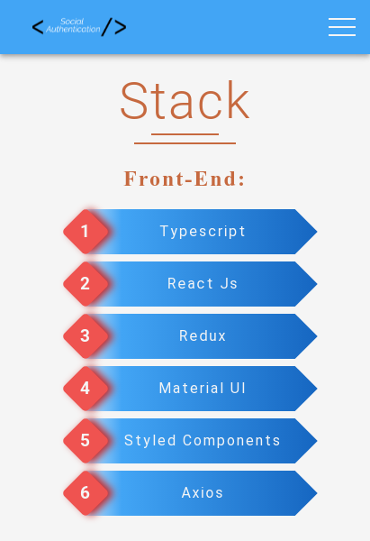
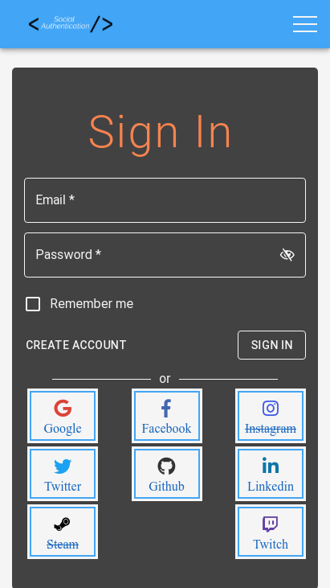
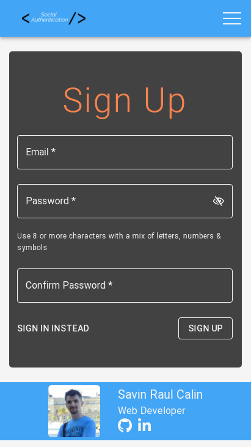

# Social-Authentication-Link
Social authentication using passport.js strategies

## Screenshots
| Home | Sign In | Sign Up | Contact |
|:----:|:----:|:----:|:----:|
|  | |  |  |

## Stack

- Backend
  - Node Js
  - Express
  - MongoDB
  - PassportJs
  - Typescript

- Front-end
  - React
  - Redux
  - Typescript
  - Axios
  - Material-ui
  - Styled-components